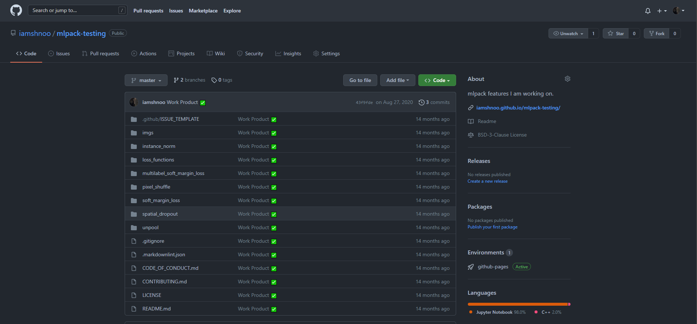
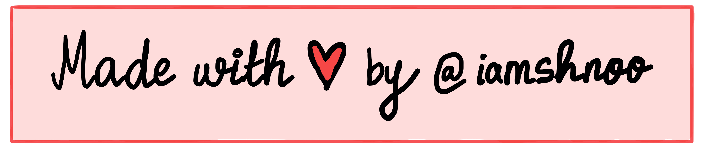

 
   

<h1 align="center">
  Hi , I'm Anjishnu (shnoo)
</h1>

<h2 align="center">
  Check out my <a href=https://iamshnoo.github.io/ target=_blank> website !!</a>
</h2>

  
  
  
  
  <!-- Star counter - https://github.com/idealclover/GitHub-Star-Counter -->
  
  
  
  

 
   

<!-- ## 🔥 Streak stats

  

 -->

- 💻I have previously [worked](https://github.com/iamshnoo/mlpack-testing)
  with [mlpack](https://github.com/mlpack) as a
  [Google Summer of Code](https://summerofcode.withgoogle.com/) student.
  I am part of the core mlpack Contributors team.

  

  
  

  

- 👨‍🏫I have also worked with the
  [Computer Graphics and Virtual Reality Research Lab](https://cgvr.cs.uni-bremen.de/)
  on research regarding continuous collision detection.

<!--   

  
  

  
 -->

- 🩺I even have a couple of
  [papers](https://www.researchgate.net/profile/Anjishnu-Mukherjee) with
  researchers from MIT and University of Toronto regarding applications of deep
  learning methods to clinical proecdures
  that help in early detection of cancer.

- 🔭 I will be starting my graduate studies in Fall 2022. My current research
  interests primarily lie in fairness, interpretability and explainability for
  language models.

<!-- - 👯 I’m looking to collaborate on **research projects related to XAI or anything else that is cool :)** -->

- 📝 I write articles on [https://iamshnoo.github.io/blog/](https://iamshnoo.github.io/blog/)

<!-- - 💬 Ask me about **NLP.** If you are an undergraduate student, I might be able to help you in getting started with the basics depending on my prior time commitments!

- 📫 How to reach me **mukherjee.anjishnu@gmail.com** -->

- 😄 Pronouns: [he/him](http://pronoun.is/he)

<!-- - 📄 Know about my experiences [https://www.linkedin.com/in/anjishnumukherjee/](https://www.linkedin.com/in/anjishnumukherjee/)

- ⚡ Fun fact: **I am obsessed with KPop.** -->

<h3 align="left">Connect with me:</h3>

<h3 align="left">Languages and Tools:</h3>

<!--

-->

<!--

&nbsp;

-->

<!--
**iamshnoo/iamshnoo** is a ✨ _special_ ✨ repository because its `README.md` (this file) appears on your GitHub profile.

- 🔭 I’m currently working on ...
- 🌱 I’m currently learning ...
- 👯 I’m looking to collaborate on ...
- 🤔 I’m looking for help with ...
- 💬 Ask me about ...
- 📫 How to reach me: ...
- 😄 Pronouns: ...
- ⚡ Fun fact: ...
-->
